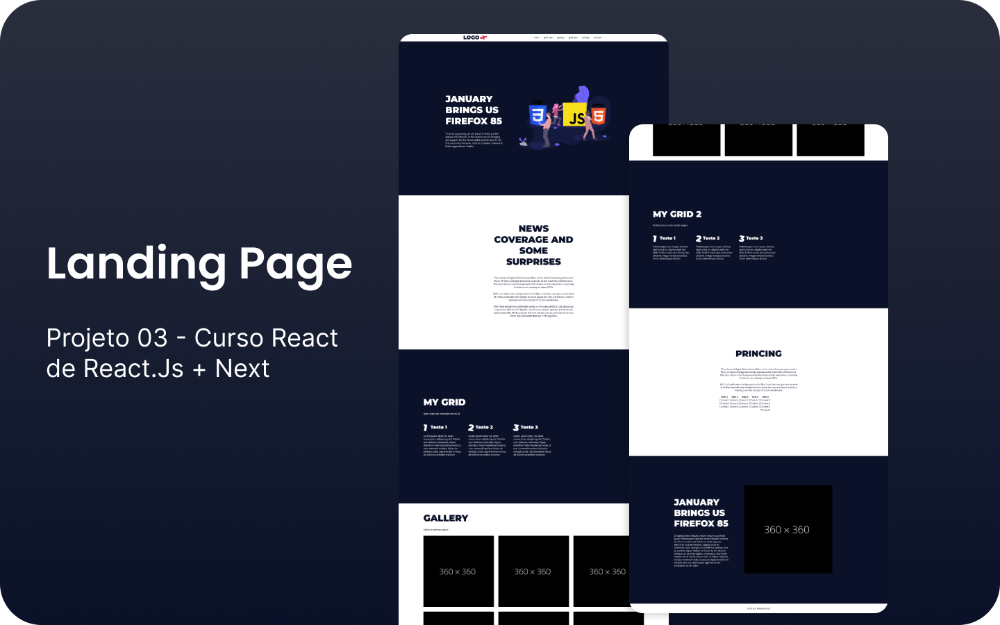

  

## 📄 Landing Page - Projeto 03
Desenvolvido durante curso de react.js afim de aprimorar e obter novos conhecimentos. Se trata de uma landing page simples, com foco mais no desenvolvimento do que no layout em si.

> ⚠️ Projeto em desenvolvimento e utilizado para testes.

## 🚀 Tecnologias
As seguintes tecnologias foram utilizadas no desenvolvimento do projeto

- React
- React Router Dom
- Styled Components
- Storybook
- Jest

## 👷 Como usar

Para executar o projeto basta realizar o clone desse projeto com seguinte comando:

- Faça o clone desse repositório `git clone https://github.com/SrWess/curso-react-project-3-front.git`
- Acesse a pasta `cd curso-react-project-3-front`
- Instale as dependências `yarn install` ou `npm install`
- Para acessar a aplicação execute: `yarn start` ou `npm start`

Para página funcionar corretamente é necessário que realize o clone do backend que foi desenvolvido com Strapi CMS, procedimentos:

- Faça o clone desse repositório `git clone https://github.com/SrWess/curso-react-project-3-backend.git`
- Acesse a pasta `cd curso-react-project-3-backend`
- Instale as dependências `yarn install` ou `npm install`
- Executando aplicação `yarn develop` ou `npm develop`
- Acessar seguinte endereço para ter acesso ao CMS: `http://localhost:1337/admin`
- Email de acesso: `srwess@protonmail.com` / Senha: `Admin1234`
- Após isso terá acesso ao CMS da página landing-page na qual foi criada

- Visualização da página é no endereço: `http://localhost:3000`
- Portal CMS: `http://localhost:1337`

## 🔗 Projeto Back-End
- [Acessar projeto](https://github.com/SrWess/curso-react-project-3-backend)
